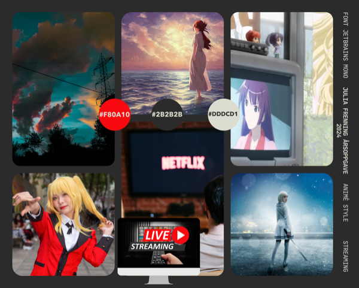

# NinjaFlix

## Vurderingskriterier

- [ ] Satt personlige læringsmål
- [ ] Planlagt prosjektet
- [ ] Dokumentert hvordan du jobbet med prosjektet
- [ ] Brukt passende verktøy
- [ ] Forklart valg av verktøy
- [ ] Brukt tilbakemeldinger for å forbedre arbeidet
- [ ] Gjennomført brukertesting
- [ ] Rapportert brukertesting
- [ ] Bruker farger, grafikk og fotografi på en god måte
- [ ] Bruker Internett og AI

### Funksjonelle krav

- [ ] Passet på filstørrelser
- [ ] Valgt riktige filformater
- [ ] Brukt nettverk for å gjøre prosjektet tilgjengelig
- [ ] Ryddig og kommentert kode
- [ ] Universell utforming (WCAG2 og UU tilsynet)
- [ ] Bruker animasjoner
- [ ] Bruker fonter

### Ikke funksjonelle krav

- [ ] Fokusert på brukervennlighet
- [ ] Tilpasset målgruppen og budskapet
- [ ] Fulgt lover og regler, tenkt på hva som er rett og galt

## Læringsmål

Mine læringsmål for dette prosjektet er:

1. Planlegge prosjektet og jobbe jevnt fram mot deadline
1. Å planlegge og gjennomføre brukertesting
1. Lære hvordan man bruker figma til interaktive prototyper
1. Lage en bra og forståelig kode
1. Jobbe tett med mentor. Og be ofte om tilbakemeldinger til prosjektet.

## Planlegging

Hvordan har det gått hittil
Starter på nytt med ny oppgave
Veiledning til prosjektledelse
Min plan for arbeidet er:
Hva er planen for animasjoner

## Moodboard

## Brukertesting
...
- Se på anime
- Oppdage ny og spennende anime
- Spare anime man vil se til senenre
- Kunne fortsette på en anime og starte på samme sted selv om man måtte lukke tjenester
- Få gode anbefalinger 
- Finne anime enkelt i søk funksjonen

## Backend 
Jeg ville fokusere på frontend kodingen og designet og trengte hjelp til backend. Jeg fikk hjelp hjemme til å lage en prototype for en tenkt backend, denne koden finnes i `common.js`. Vi lastet ned en del filmer fra YouTube, lagde thumbnails av dem og lagret dem i skyen. 

## Nettverk
Jeg brukte GitHub som kildekontroll gjennom hele prosjektet. [Prosjektet kan ses her.](https://github.com/chrfrenning/ninjaflix-frontend)

Jeg fikk hjelp til å publisere nettstedet på Azure websites. [Prosjektet kan testes her.](https://ninjaflix.no/) Vi kjøpte også domene Ninjaflix.no på Domeneshop. 

TODO: publisere på skolens nettverk.

TODO: Flytte ninjaflix.no pekeren til min egen Azure

## Spærsmål til mentor
- Hvordan levere figma prosjektet? Ta screenshots og URL i rapporten?
- Spør: Ludvik om nettverk

## Logg
### Uke 15
| Day      | Log                                      |
|----------|------------------------------------------|
| Monday   | Re-started my task and started planning what to do this week. |
| Tuesday  | Made a mood board.|
| Wednesday| Started learning how to use Figma for making a prototype of the website. |
| Thursday | Started making the prototype.|
| Friday   |                                          |

#### Why I restarted my task:
I restarted my task because I had no motivation for the helping website for Kuben students and it sounded a lot more exciting to start on the streaming website instead.

### Uke 16
| Day      | Log                                      |
|----------|------------------------------------------|
| Saturday |  Fixed recommended and watch later lists in code, mostly finished figma phone prototype|
| Sunday   |  Added logo and tweaked design|
| Monday   |  Made figma prototype interactive|
| Tuesday  |  Made "Favorite button" interactive|
| Wednesday|  Looked for fonts for website|
| Thursday |  Other school stuff|
| Friday   |  Feedback from teacher|

### Uke 17
| Day      | Log                                      |
|----------|------------------------------------------|
| Saturday | Read [about UX testing](https://www.usit.uio.no/om/organisasjon/ffu/ux/blogg/2017/brukertest.html) Published website in my new azure subscription. Made a lot of changes to the repport. |
| Sunday   |                                          |
| Monday   |  |
| Tuesday  |                        |
| Wednesday|  |
| Thursday |              |
| Friday   |  |

### Uke ..
| Day      | Log                                      |
|----------|------------------------------------------|
| Saturday |  |
| Sunday   |  |
| Monday   |  |
| Tuesday  |  |
| Wednesday|  |
| Thursday |  |
| Friday   |  |
