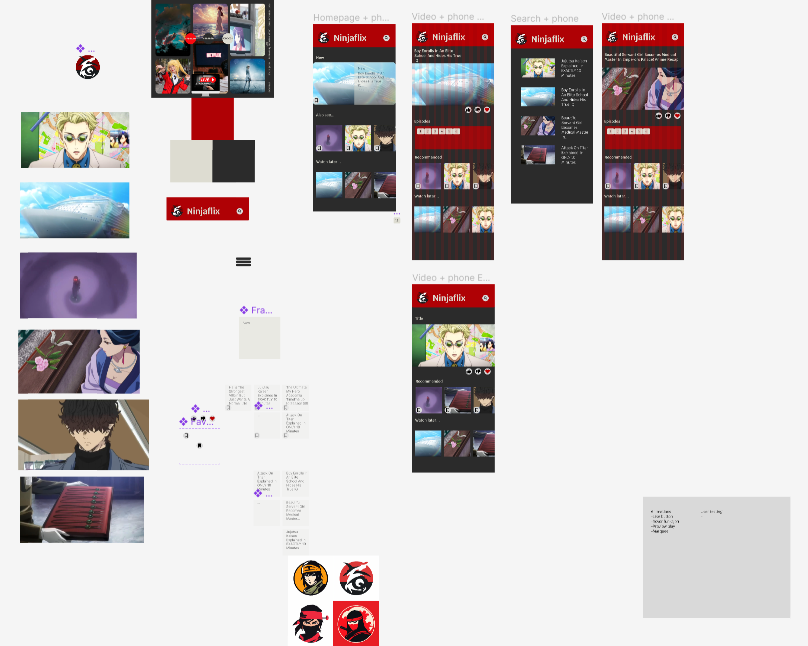
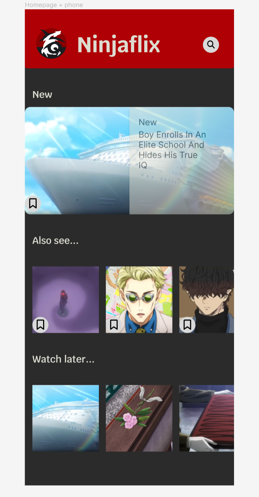

# NinjaFlix

## Vurderingskriterier

- [x] Satt personlige læringsmål
- [ ] Planlagt prosjektet
- [ ] Dokumentert hvordan du jobbet med prosjektet
- [x] Brukt passende verktøy
- [x] Forklart valg av verktøy
- [ ] Brukt tilbakemeldinger for å forbedre arbeidet
- [ ] Gjennomført brukertesting
- [ ] Rapportert brukertesting
- [ ] Bruker farger, grafikk og fotografi på en god måte
- [x] Bruker Internett og AI

### Funksjonelle krav

- [x] Passet på filstørrelser
- [x] Valgt riktige filformater
- [ ] Brukt nettverk for å gjøre prosjektet tilgjengelig
- [ ] Ryddig og kommentert kode
- [ ] Universell utforming (WCAG2 og UU tilsynet)
- [ ] Bruker animasjoner
- [x] Bruker fonter

### Ikke funksjonelle krav

- [ ] Fokusert på brukervennlighet
- [x] Tilpasset målgruppen og budskapet
- [ ] Fulgt lover og regler, tenkt på hva som er rett og galt

## Læringsmål

Mine læringsmål for dette prosjektet er:

1. Planlegge prosjektet og jobbe jevnt fram mot deadline
1. Å planlegge og gjennomføre brukertesting
1. Lære hvordan man bruker figma til interaktive prototyper
1. Lage en bra og forståelig kode
1. Jobbe tett med mentor. Og be ofte om tilbakemeldinger til prosjektet.

## Planlegging

Jeg startet på oppgaven om informasjonsside om Kuben. Jeg ble sittende fast og syntes det var vanskelig å lage innhold til siden. De første ukene fikk jeg ikke gjort så veldig mye. Jeg valgte å endre oppgave til streamng nettsted for da kunne jeg laste ned innhold som jeg er inntersert i fra YouTube. Jeg fikk også mere hjelp hjemme til prosjekt styring og en backend prototype som gjorde det mulig å få litt kul funksjonalitet. Jeg skal fokusere på frontend. Jeg lager moodboard for målgruppen min og bytter fra Adobe XD til Figma for å lage prototype. Jeg skal implementere frontended med HTML, CSS og JavaScript. Jeg skal lage animasjoner i CSS og bruke fonter fra Adobe. 

## Om Ninjaflix

Ninjaflix skal bli en app og et nettsted for de som har lyst til å se på anime trygt og gratis. Målgruppen er ungdommer og unge voksene i alderen 13-25. Jeg antar at alle har en mobil og at de primert kommer til å bruke denne nettsiden på mobilen sin. 

## Moodboard

Jeg har tatt inspirasjon fra Netflix og YouTube. De som er kjent med disse appene skal  kunne enkelt kunne finne seg frem på ninjaflix. Farger, kontraster og grafikk er inspirert av anime og cosplay. 

## Prototype

Jeg brukte figma til å lage en interaktiv prototype av appen. Jeg begynte først i Adobe XD, men bytett til figma fordi det føltes for meg at det ble enkldere å bruke. Noe jeg syntes er fint med figma er at det var enkelt å gjøre prototypen interaktiv og enklere å finne hjelpe videoer på youtube. Det ble enkelt å tweake på designet fordi man kan lage komponenter og når man endrer dem så oppdaterer alle kopier av den komponenten med en gang.

Her kan dere se alle skjermene i ninjaflix prototypen. [Hele prosjektet kan ses her.](https://www.figma.com/file/OrqfHpCBjGeqlZ18T2DPhD/Ninjaflix?type=design&node-id=0%3A1&mode=design&t=N35wwKMUdCEAEl0U-1) (Jeg fant ikke noen måte å exportere filene å legge dem i en zip, men nedenfor ser dere en screenshot også.)

Nedenfor ser dere hjemmeskjermen. Det som er viktig med den er at man kan få se ny anime som akkurat kom ut. Man skal få forslag for å finne ting man kan like, og som man vil se i fremtiden. Man skal også kunne fortsette på ting man har startet å se.

[Test prototypen her.](https://www.figma.com/proto/OrqfHpCBjGeqlZ18T2DPhD/Ninjaflix?type=design&node-id=1-3&t=N35wwKMUdCEAEl0U-0&scaling=scale-down&page-id=0%3A1&starting-point-node-id=1%3A3)

## Brukertesting

I brukertestingen vil jeg finnne ut om brukerene kan løse de viktigste oppgavene i appen:

- Se på anime
- Oppdage ny og spennende anime
- Spare anime man vil se til senenre
- Kunne fortsette på en anime og starte på samme sted selv om man måtte lukke tjenester
- Få gode anbefalinger 
- Finne anime enkelt i søk funksjonen

Jeg vil gi dem åpene oppgaver og se hvordan de utfører dem. Jeg skal ta notater underveis. 

### Testing av prototypen 
Figma er et skisseverktøy. jeg har brukt det for å lage en prottotype av mobilappen Ninjaflix. Prototype vil ikke ha all funksonalitet som den endlige appen, men den vil gi et bilde av hvordan appen kan fungere. Jeg bruker prototypen som jeg har laget i figma som et verktøy i brukertesting for at jeg tidlig skal kunne få god feedback på appen og for at jeg skal kunne gjøre justeringer tidlig i prosessen. 

Desverre kunne jeg ikke legge inn video i figma uten å betale så i brukertesten bruker jeg bare bilder. 

#### Manuskript
Takk for at du hjelper meg med oppgaven og vil være med på en brukertest. Ninjaflix er en app som lar deg streame anime. 

|Spørsmål|Person 1|Person 2|Person 3|Person 4|Notater|
|-|-|-|-|-|-|
|Alder|15-20|15-20|15-20|20-30||
|Anime entusiast|Ja|Ja|Nei|Nei||
|Her er en prototype. Kan du finne en film og se på den?|Gjorde det raskt|Gjorde det raskt|Gjorde det raskt|Ja||
|Tenk deg at du finner en interessant serie men ikke har tid til å se på den nå. Hva gjør du da?|Gjorde det raskt|Fant ut av det uten hjelp|Fant ut av det uten hjelp|Ja||
|Noen anbefaler en serie til deg. Kan du finne den?|De skroller og finner den, eller de tenker at de kan søke.|De søker med en gang|De søker med en gang|Tenker ikke på å søke men blar gjennom de forskjellige tittlene for å finne den|Kanskje gjøre søkefunksjonen enklere å finne|

#### Konklusjon 

Jeg gjorde brukertesting av prototypen i Figma med brødrene og bonusmoren min. De forsto konseptet og fant lett ut hvordan man navigerte. 

Brukertesten over ble gjennomført på skolen med elever og en lærer med en tidlig utgave av appen. Appen ligner veldig på andre streaming nettsteder, og det har jeg gjort med vilje slik at all lett forstår den. Jeg har også blitt inspirert av Netflix sine farger, og ønsker at det skal være en gjennskjennings effekt.

Alle brukerne klarte fint å bruke appen, ingen trengte hjelp, men noen brukte litt tid på å finne ut hvordan de skulle gjøre en oppgave. 

## Backend 
Jeg ville fokusere på frontend kodingen og designet og trengte hjelp til backend. Jeg fikk hjelp hjemme til å lage en prototype for en tenkt backend, denne koden finnes i `common.js`. Vi lastet ned en del filmer fra YouTube, lagde thumbnails av dem og lagret dem i skyen. 

TODO: Make heart function work
TODO: Make fature work 
TODO: Søk funksjon funker ikke 

## Nettverk
Jeg brukte GitHub som kildekontroll gjennom hele prosjektet. [Prosjektet kan ses her.](https://github.com/chrfrenning/ninjaflix-frontend)

Jeg fikk hjelp til å publisere nettstedet på Azure websites. [Prosjektet kan testes her.](https://ninjaflix.no/) Vi kjøpte også domene Ninjaflix.no på Domeneshop. 

TODO: publisere på skolens nettverk.

TODO: Flytte ninjaflix.no pekeren til min egen Azure

## Verktøy
Jeg har laget en oversikt over verktøyene jeg har brukt, og en kort beskrivelse av hva jeg har brukt dem til og hvorfor.
| Product | Description |
|---------|-------------|
| Figma  | Laget interaktiv prototype av produktet, tidlig brukertesting med figma sin mobil app. |
| Midjourney  | Utkast til logo. |
| Adobe Illustratior  | Brukt til å lage logo til vektorgrafikk med bezier kurver. Expoterte som svg. |
| Adobe fonts  | Bruker font lunatix fra adobe. |
| Canva  | Lagde moodboard med mal frunnet på canva. Og bilder på moodboard er også fra canva. |
| Visual studio code  | Kodet i HTML, CSS og JavaScript her. |
| Github copilot  | KI hjelp i koden, brukte både chat og auto complete. |
| Github.com  | Lagret koden i Github.com. |
| Azure | Satte opp static webapp til å automatisk publisere koden fra Github. |
| Domeneshop  | Kjøpte domenet Ninjaflix.no, og laget peker til Azure. |
| Markdown  | Skrev rapporten i markdown. |

## Spærsmål til mentor
- Hvordan levere figma prosjektet? Ta screenshots og URL i rapporten?
- Spør: Ludvik om nettverk

## Logg
### Uke 15
| Day      | Log                                      |
|----------|------------------------------------------|
| Monday   | Re-started my task and started planning what to do this week. |
| Tuesday  | Made a mood board.|
| Wednesday| Started learning how to use Figma for making a prototype of the website. |
| Thursday | Started making the prototype.|
| Friday   |                                          |

#### Why I restarted my task:
I restarted my task because I had no motivation for the helping website for Kuben students and it sounded a lot more exciting to start on the streaming website instead.

### Uke 16
| Day      | Log                                      |
|----------|------------------------------------------|
| Saturday |  Fixed recommended and watch later lists in code, mostly finished figma phone prototype|
| Sunday   |  Added logo and tweaked design|
| Monday   |  Made figma prototype interactive|
| Tuesday  |  Made "Favorite button" interactive|
| Wednesday|  Looked for fonts for website|
| Thursday |  Other school stuff|
| Friday   |  Feedback from teacher|

### Uke 17
| Day      | Log                                      |
|----------|------------------------------------------|
| Saturday | Read [about UX testing](https://www.usit.uio.no/om/organisasjon/ffu/ux/blogg/2017/brukertest.html) Published website in my new azure subscription. Made a lot of changes to the repport. |
| Sunday   | Lagert ny JS fil for felles komponenterm, laget header, lagt inn logo, CSS farger fra prototype, skrevet rapport om moodboard, prototype, verktøy og målgruppe.  |
| Monday   | Laget brukertesting spørsmål og finpusset på figma. Laget promo for ny film på hjemmesiden. Stylet tittler og knapper. |
| Tuesday  | Pause |
| Wednesday| Laget animert slide show for featured films |
| Thursday | Clean up av CSS og HTML for feature |
| Friday   |  |

### Uke 18
| Day      | Log                                      |
|----------|------------------------------------------|
| Saturday |  |
| Sunday   | Lagde feature-new, gjore det sånn at man før autromatikt nye videoer nor de blir lagt inn. |
| Monday   | Fikset tekst på featured og videoer under. |
| Tuesday  |  |
| Wednesday|  |
| Thursday | Brukertesting |
| Friday   |  |

### Uke 19
| Day      | Log                                      |
|----------|------------------------------------------|
| Saturday |  |
| Sunday   |  |
| Monday   |  |
| Tuesday  |  |
| Wednesday|  |
| Thursday |  |
| Friday   |  |

### Uke ..
| Day      | Log                                      |
|----------|------------------------------------------|
| Saturday |  |
| Sunday   |  |
| Monday   |  |
| Tuesday  |  |
| Wednesday|  |
| Thursday |  |
| Friday   |  |
